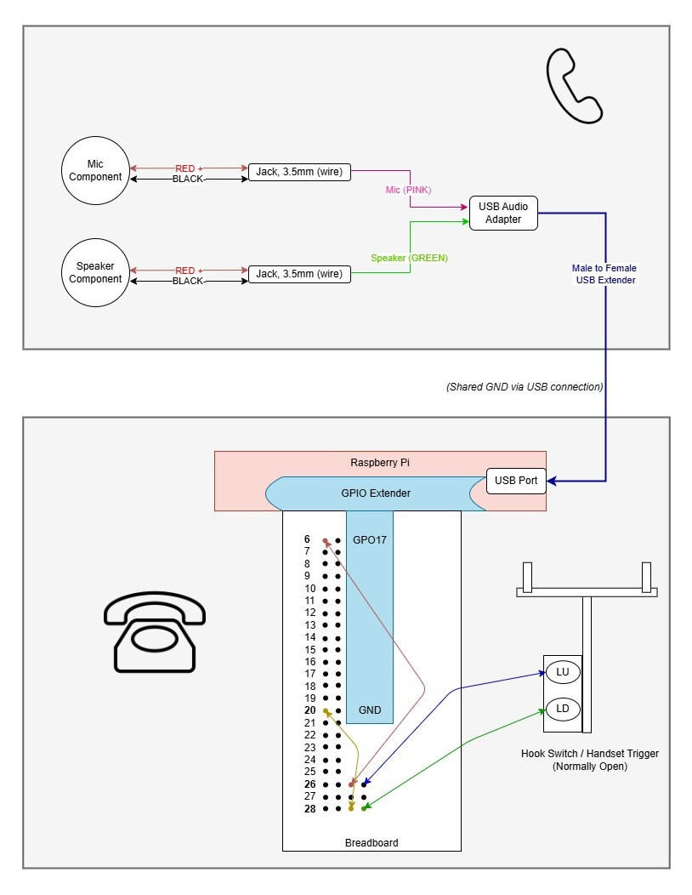

# Audio Guestbook
Code for audio guestbook for wedding: Raspberry Pi, Flask and GPIO

An interactive audio guestbook that plays greetings and records voice messages through a repurposed vintage telephone headset
This project merges analog design with modern IoT software, utilizing Python, Flask and ALSA/USB Audio built on a Raspberry Pi.

## Overview
When a guest lifts the phone, a greeting (Greeting.wav), followed by a beeping tone (Beep.wav) indicating to the user that the guestbook is now recording their message. Once the phone is put back on the receiver, it is saved as a WAV file both in local storage and uploaded to an S3 bucket.
(In Progress) Also included is a Flask web dashboard that allows you to review and replay recordings. 

## Architecture

## Core Components
- Hardware: Raspberry Pi 4, Core Compute and GPIO Controller
- Audio Interface: AB13X USB Sound Card (Provides mic input + speaker output via a 3.5mm jacks)
- Handset: 36mm 8Ω speaker + uxcell 6mm electret mic (Wired to USB sound card inside the phone)
- Button / Hook Switch: GPIO17  → Ground (Detects whether the lever that holds the handset is up or down)
- Software: Python 3, Flask, ALSA, RPi.GPIO (Controls playback, recording and web UI)
- Shell Scripts: 
    - ```start_flask.sh```: Starts local Flask UI
    - ```start_guestbook.sh```: Starts audio guestbook service

## How It Works
1. Once the Raspberry Pi is powered on, ```start_guestbook.sh``` is executed and the script waits for GPIO17 to close (the handset is lifted from   the lever)
2. A greeting is played through the 36mm 8Ω speaker in the handset's ear piece, ```Greeting.wav```, followed by a ```Beep.wav``` to simulate a the experience of 'leave a message at the tone'. 
3. The uxcell 6mm electret mic captures audio input via ```arecord -D plughw:3,0``` until the handset is hung up and the lever is pressed down. 
4. Next, the recorded audio file will be saved to local storage on the Raspberry Pi as well as uploaded to an S3 bucket. 
5. After the usage of the audio guestbook, a UI built with Flask can be utilized to view and playback audio messages stored in the S3 bucket. 

## Architecture & Layout

*Figure 1: Hardware wiring diagram showing the microphone, speaker, USB audio interface and hook (GPIO17) connections to the Raspberry Pi 4. The USB Soundcard handles all of the analog audio input and output, while the GPIO17 monitor's the handset's lift/hang-up state*

### Notes on Hardware Layout
- The **USB Audio Adapter** handles both microphone (pink) and speaker (green) jacks, which is then connected to a Male-to-Female USB extender, which is fed through the hole in the handset to the Raspberry Pi's USB port. 
- The USB connection provides a **shared group (GND)** reference between the Pi and the USB Sound Adapter labeled as **“(Shared GND via USB connection)”**. This ensures that the microphone, speaker and GPIO circuits operate with a common electrical reference, even though the audo path is isolatted within the USB interface. 
- The **hook switch** (shown in the bottom right) connects between **GPIO17** and **GND**. When the handset is lifted, the circuit closes, triggering the Python service to begin audio playback and recording.
- Each audio path (mic/speaker) uses mono 3.5mm leads soldered to internal components in the handset, matching the diagram. The Raspberry Pi and GPIO Extender live within the base of the vintage phone.  

